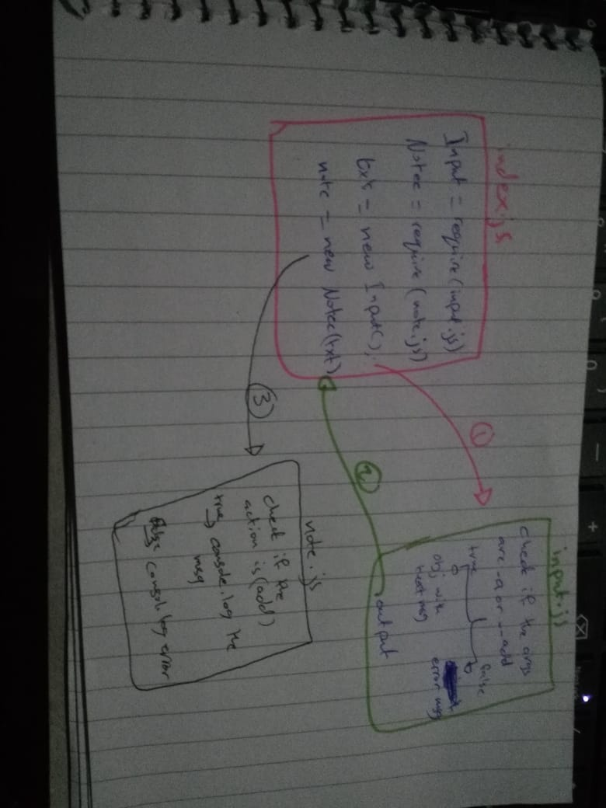

# LAB - 01
## Node Ecosystem
### Author: Israa Othman
### Links and Resources
- [submission PR](https://github.com/401-advanced-javascript-israaOthman/notes/pull/2)
### Modules
#### `Node.js`
### Packages
#### `minimist`
#### How to initialize/run your application (where applicable)
- e.g. `node index.js --add 'some note'`
- e.g. `node index.js -a 'some note'`
- e.g. `./index.js --add 'some note'`
- e.g. `./index.js -a 'some note'`
#### How to use your library (where applicable)
#### Tests
- Test: '`node index.js (anything except [--add || -a ]) 'creating my first note'`' => 'you should use (--add) or (--a/-a) to add a message'
#### UML
